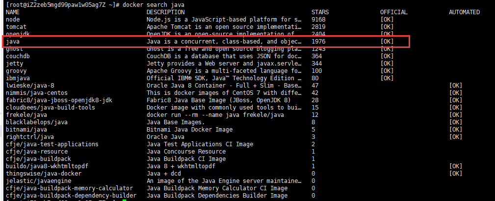
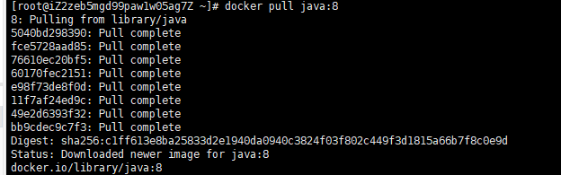
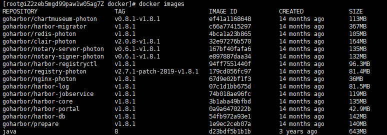
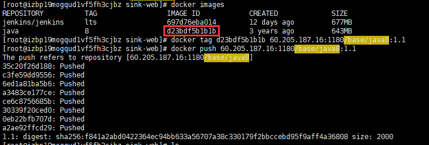

- 下载java镜像
> `进行镜像推送的前提必须完成harbor镜像仓库的安装`
```shell script
docker search jav
```


- 开始下载
```shell script
docker pull java:8
```


- 查看镜像
```shell script
docker images
```


- 登录
```shell script
docker login -u name -p pwd ip:port
```
- 标记镜像
> docker tag SOURCE_IMAGE[:TAG] ip:port/IMAGE[:TAG]
```shell script
docker tag ${image_id} 60.205.187.16:1180/base/java8:1.1
```
- 推送镜像
> docker push ip:port/base/IMAGE[:TAG]
```shell script
docker push 60.205.187.16:1180/base/java8:1.1
```
