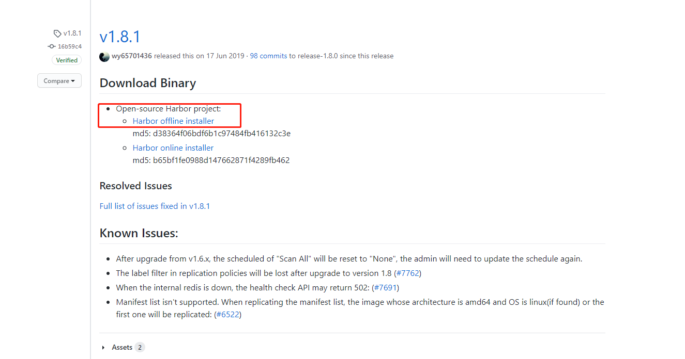
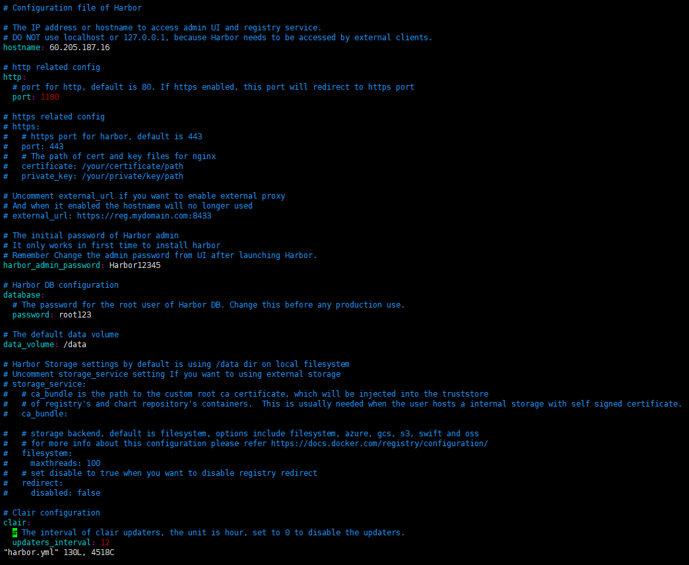
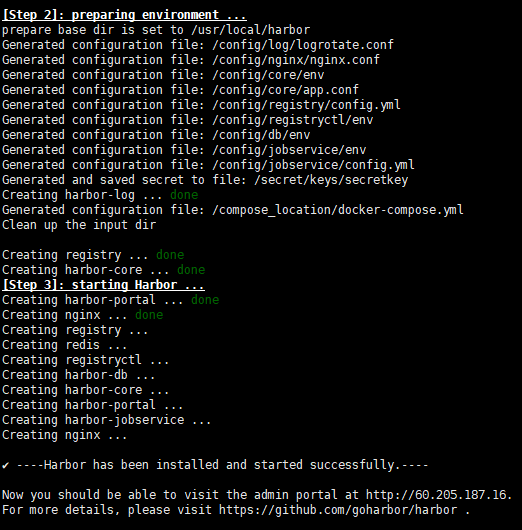
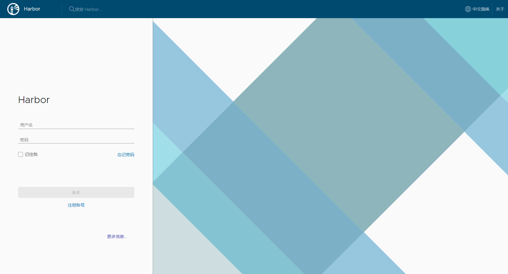

> https://github.com/goharbor/harbor/releases?after=v1.8.2

- 下载Harbor离线安装包
```base
wget https://storage.googleapis.com/harbor-releases/release-1.8.0/harbor-offline-installer-v1.8.2.tgz
```

> `安装和配置。由于harbor包括docker,docker-composere和client只需安装docker即可`
- Docker安装
> 参考 [docker安装](/docker/docker_install.md) 此处不再赘述

- Docker Composere安装。直接yum安装
```shell script
yum install epel-release
yum -y install docker-compose
```
- 下载Harbor最新版本的离线安装包并解压出来。https://github.com/goharbor/harbor/releases

> 解压后目录文件如下
```shell script
harbor.v1.8.2.tar.gz  harbor.yml  install.sh  LICENSE  prepare
```
- 修改`harbor.yml`文件。修改下hostname为本机的ip，harbor_admin_password web页面的密码。配置下https
[参考harbor.yml](../conf/yml/harbor.yml)


- 运行安装脚本。出现下边即为安装成功。
```shell script
sh install.sh
```


- 访问页面



## 操作
> 在harbor的安装目录,里执行命令
- 停止
```shell script
 docker-compose stop
```
- 启动
```shell script
docker-compose start
```

- 登录账户
> /etc/docker/
> docker login -u admin -p Sink1234 60.205.187.16:1180
> Error response from daemon: Get https://60.205.187.16:1180/v2/: http: server gave HTTP response to HTTPS client
```shell script
sudo mkdir -p /etc/docker
sudo tee /etc/docker/daemon.json <<-'EOF'
{
    "registry-mirrors": ["https://bpma5bzi.mirror.aliyuncs.com"],
    "insecure-registries": ["60.205.187.16:1180"]
}
EOF
sudo systemctl daemon-reload
sudo systemctl restart docker
```
- 配置Docker加速器 [参考文件daemon.json ](../conf/json/daemon.json)
> 这种写法是没有配置Docker加速器的情况下
```shell script
// 单个私服的写法
{
    "insecure-registries": ["registry的IP地址:端口号"]
}
// 多个私服的写法
{
    "insecure-registries": ["registry1的IP地址:端口号","registry2的IP地址:端口号"]
}
```
> 这种写法是配置过Docker加速器的情况下
```shell script
// 没有配置加速器的

// 单个私服的写法
{
    "registry-mirrors": ["http://f1361db2.m.daocloud.io"],
    "insecure-registries": ["registry的IP地址:端口号"]
}
// 多个私服的写法
{
    "registry-mirrors": ["http://f1361db2.m.daocloud.io"],
    "insecure-registries": ["registry1的IP地址:端口号","registry2的IP地址:端口号"]
}
```
- 完成后执行命令
```shell script
systemctl daemon-reload
systemctl restart docker
systemctl enable docker
```
- 进入harbor目录
```shell script
docker-compose restart
```
- 相关操作
```shell script
docker-compose start
docker-compose stop
docker-compose restart
```