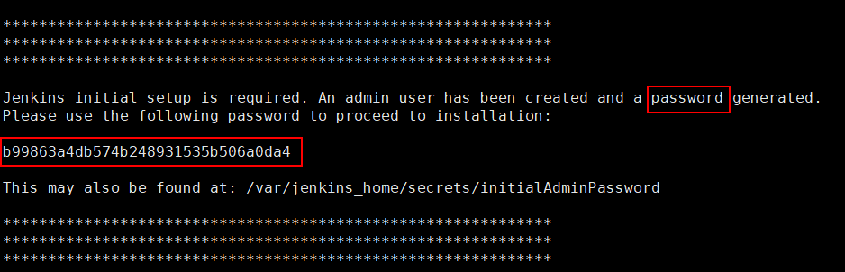
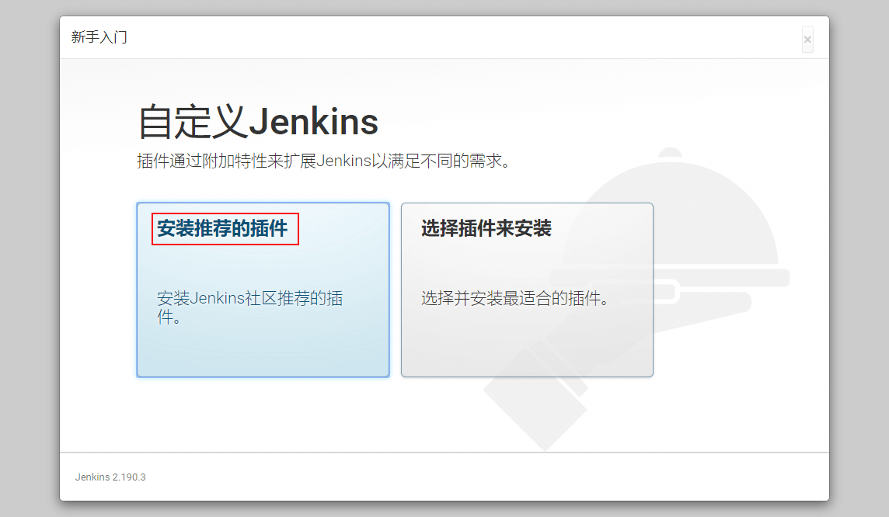
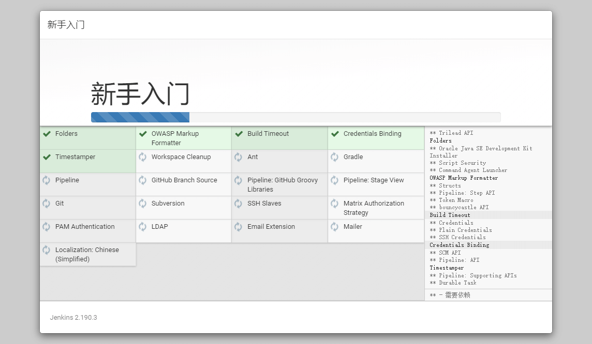
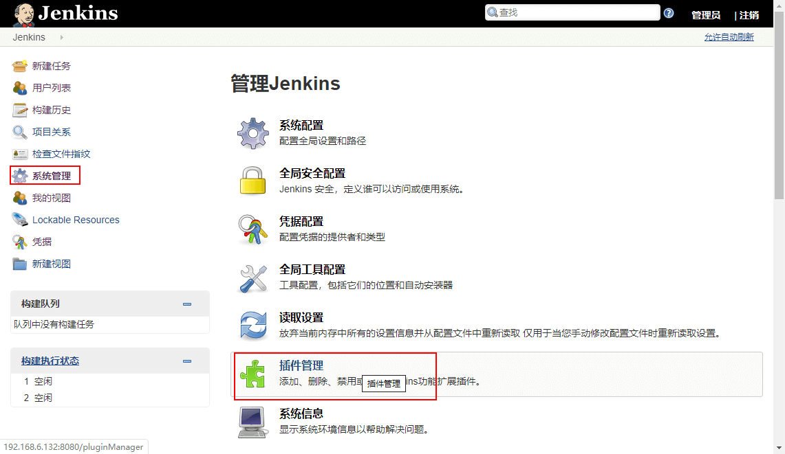

## Jenkins的安装及配置
### Docker环境下的安装

- 下载Jenkins的Docker镜像：

```shell script
docker pull jenkins/jenkins:lts
```

- 在Docker容器中运行Jenkins：

```shell script
docker run -p 8588:8080 -p 5000:5000 --name jenkins \
-u root \
-v /mydata/jenkins_home:/var/jenkins_home \
-d jenkins/jenkins:lts
```
- 参数说明
  - [本地:容器]
  - -p 8588:8080：将主机的8588端口映射到容器的8080端口
  - -v /home/jenkins:/var/jenkins_home \ ：将文件夹挂在到主机

```shell script
docker run -p 8588:8080 -p 5000:5000 --name jenkins \
-u root \
-v /usr/local/java/jdk1.8.0_221/bin/java:/usr/local/java/jdk1.8.0_221/bin/java \
-v /usr/local/java/jdk1.8.0_221:/usr/local/java/jdk1.8.0_221 \
-v /usr/local/maven:/usr/local/maven \
-v /home/jenkins:/var/jenkins_home \
-d jenkins/jenkins:lts
```

### Jenkins的配置
- 运行成功后访问该地址登录Jenkins提示

```shell script
vim /var/jenkins_home/hudson.model.UpdateCenter.xml 
https://updates.jenkins.io/update-center.json -> http://mirror.xmission.com/jenkins/updates/update-center.json
```
- 运行成功后访问该地址登录Jenkins，第一次登录需要输入管理员密码：http://112.124.13.157:8080/


- 使用管理员密码进行登录，可以使用以下命令从容器启动日志中获取管理密码：

```shell script
docker logs jenkins
```

- 从日志中获取管理员密码：



- 选择安装插件方式，这里我们直接安装推荐的插件：



- 进入插件安装界面，联网等待插件安装：



- 安装完成后，创建管理员账号：


- 进行实例配置，配置Jenkins的URL：


- 点击系统管理->插件管理，进行一些自定义的插件安装：



- 全局工具配置

