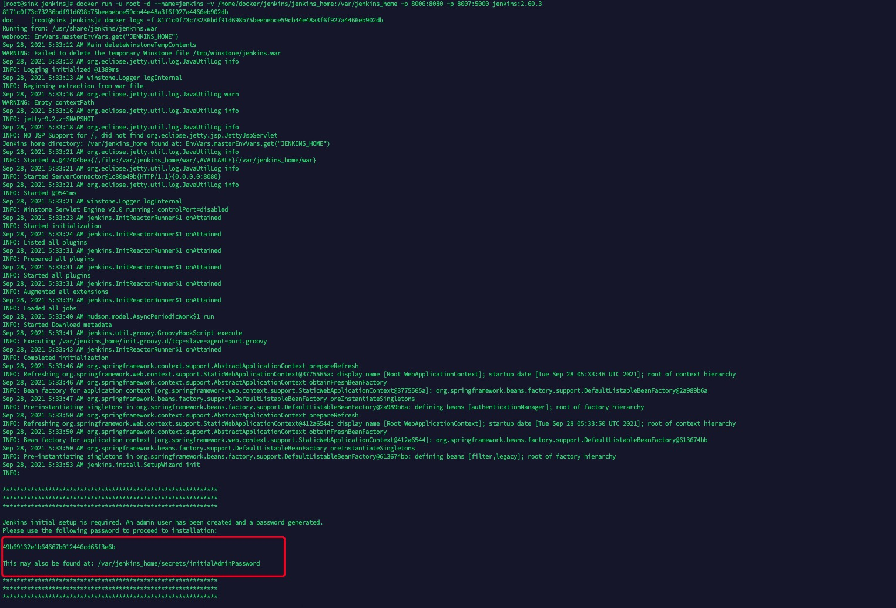
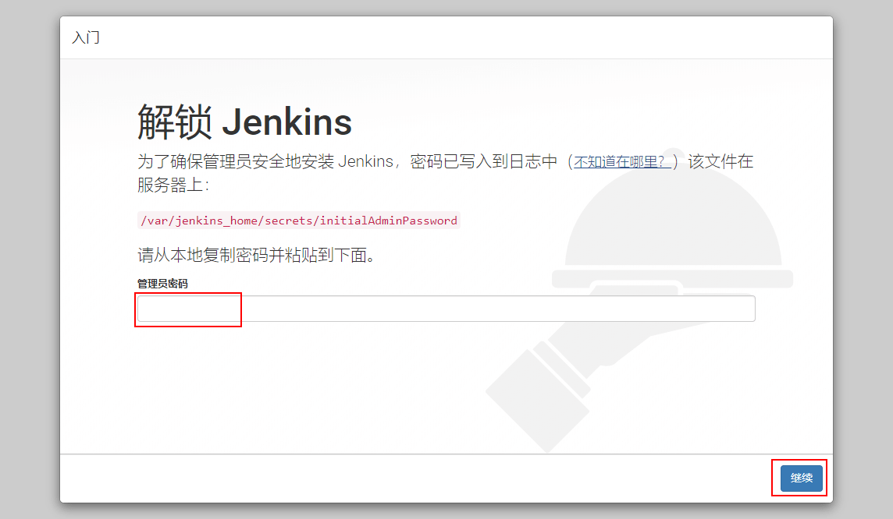
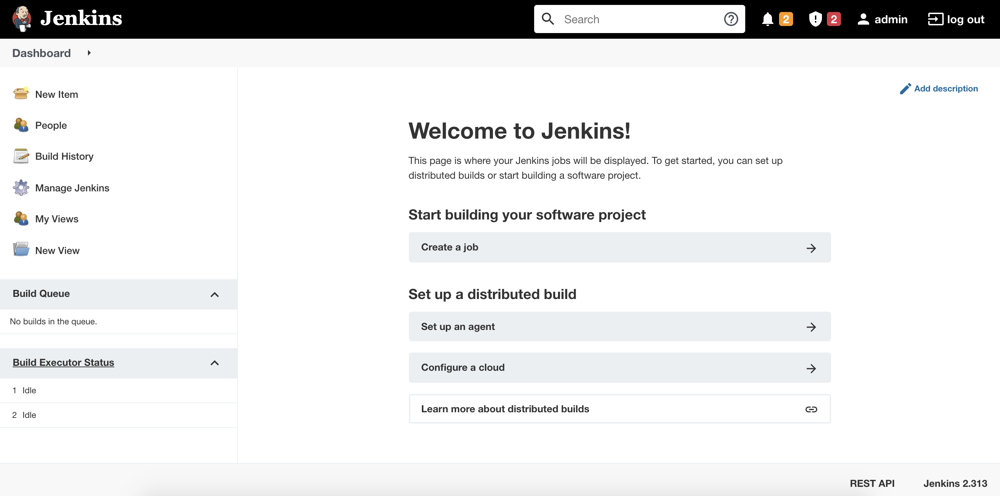
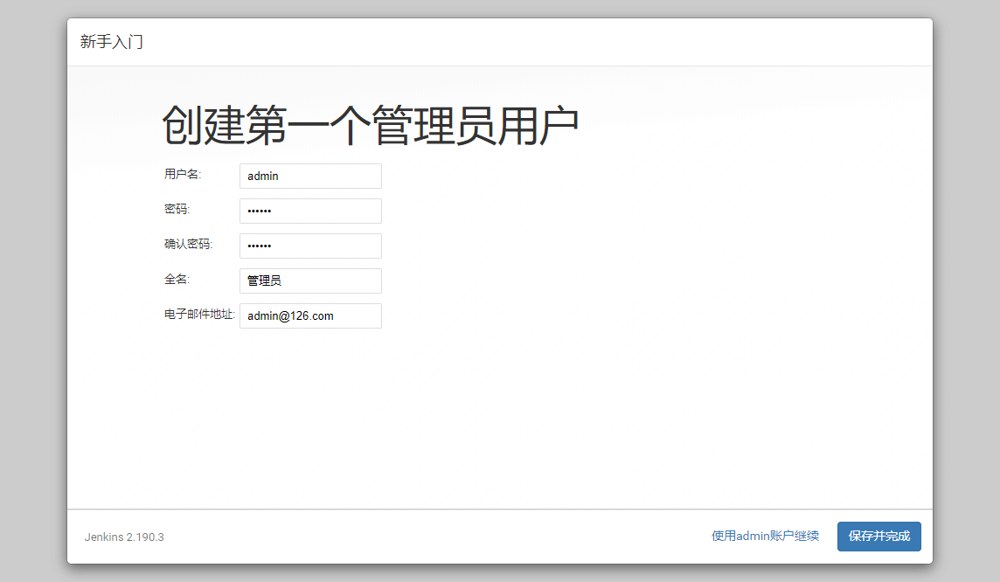
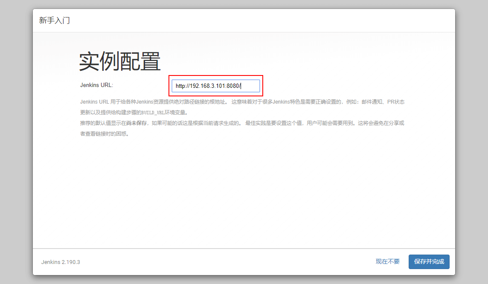
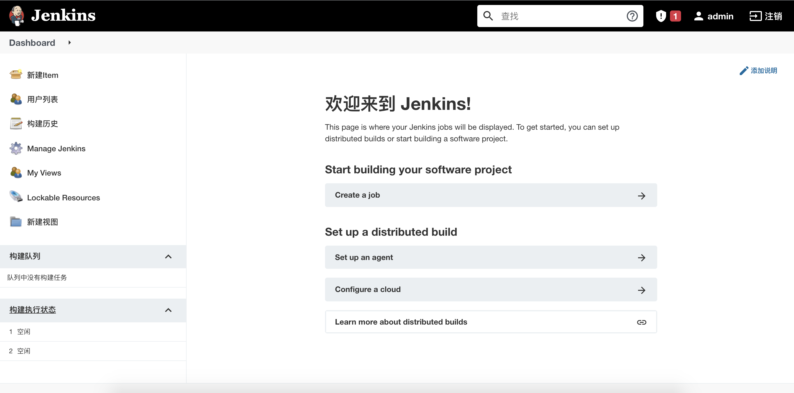
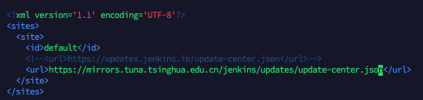

- 拉取镜像
```shell script
docker pull jenkins/jenkins:2.313
```
- 启动
```
docker run \
-d \
-u root \
--name=jenkins \
-v /home/docker/jenkins/jenkins_home:/var/jenkins_home \
-e JENKINS_HOME=/home/docker/jenkins/jenkins_home \
-p 8006:8080 \
-p 8007:5000 \
jenkins/jenkins:2.313
```
> 因为jenkins是在docker容器内安装 而maven、jdk是安装在主机的所以要配置文件挂载
```
docker run \
-d \
-u root \
--name=jenkins \
-v /home/docker/jenkins/jenkins_home:/var/jenkins_home \
-v /usr/local/java/jdk1.8.0_301/:/usr/local/java/jdk1.8.0_301 \
-v /var/local/maven:/var/local/maven \
-e JENKINS_HOME=/home/docker/jenkins/jenkins_home \
-p 8006:8080 \
-p 8007:5000 \
jenkins/jenkins:2.313
```
> 进入容器设置环境变量
```
apt-get update

apt -y install yum

vim /etc/profile

export JAVA_HOME=/usr/local/java/jdk1.8.0_301/
export JRE_HOME=/$JAVA_HOME/jre
export CLASSPATH=.:$JAVA_HOME/jre/lib/rt.jar:$JAVA_HOME/lib/dt.jar:$JAVA_HOME/lib/tools.jar
export PATH=$PATH:$JAVA_HOME/bin:$JRE_HOME/bin

export MAVEN_HOME=/var/local/maven
export PATH=$PATH:$MAVEN_HOME/bin

source /etc/profile
```
- 查看日志
```shell script
docker logs -f ${CONTAINER_ID}
```
doc     

> `复制密码并输入`  



- 选择安装方式


- 等待安装



- 设置密码


- 实例配置


- 进入主页




- 问题
> 进入首页一直处于 `Please wait while Jenkins is getting ready to work ...`  
> 修改 `/home/docker/jenkins/jenkins_home`下`hudson.model.UpdateCenter.xml`中  
> `https://updates.jenkins.io/update-center.json` 
>  更改为国内镜像地址 `https://mirrors.tuna.tsinghua.edu.cn/jenkins/updates/update-center.json`



- jenkins打包项目
>[jenkins配置](/docs/docker/jenkins_build.md)