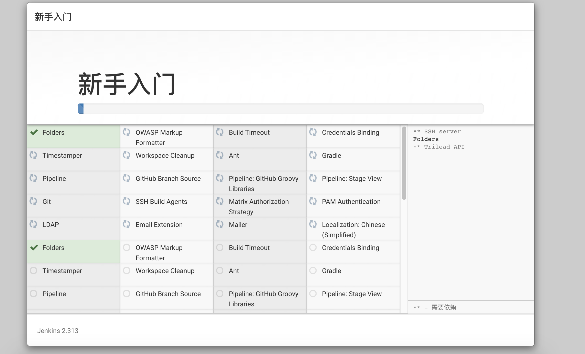

- 拉取镜像
```shell script
docker pull jenkins/jenkins:2.313
```
- 启动
```shell script
docker run \
-d \
-u root \
--name=jenkins \
-v /home/docker/jenkins/jenkins_home:/var/jenkins_home \
-p 8006:8080 \
-p 8007:5000 \
jenkins/jenkins:2.313
```

- 查看日志
```shell script
docker logs -f ${CONTAINER_ID}
```


> `复制密码并输入`  


- 选择安装方式


- 等待安装



- 设置密码


- 实例配置


- 进入主页


- 问题
> 进入首页一直处于 `Please wait while Jenkins is getting ready to work ...`  
> 修改 `/home/docker/jenkins/jenkins_home`下`hudson.model.UpdateCenter.xml`中  
> `https://updates.jenkins.io/update-center.json` 
>  更改为国内镜像地址 `https://mirrors.tuna.tsinghua.edu.cn/jenkins/updates/update-center.json`


