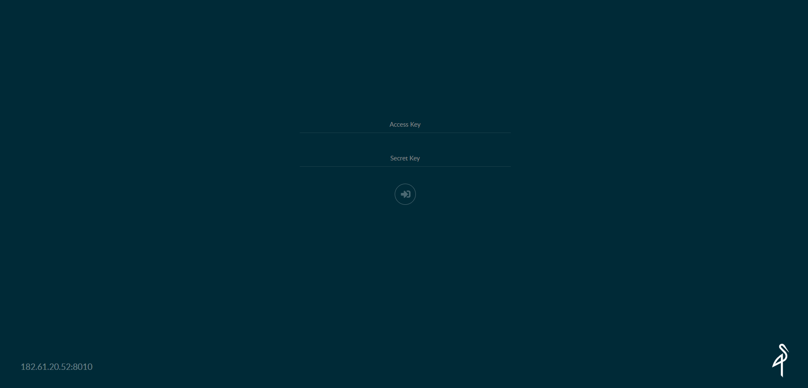

- 镜像拉取
```shell script
docker pull store/minio/minio:RELEASE.2020-12-29T23-29-29Z
```

- 启动服务
```shell script
docker run --name minio -p 8010:9000 \
-d -v /home/docker/minio/data/:/data \
-e "MINIO_ACCESS_KEY=admin" \
-e "MINIO_SECRET_KEY=admin123" \
store/minio/minio:RELEASE.2020-12-29T23-29-29Z server /data
```

- 访问
> 访问地址 127.0.0.1:8010
