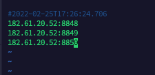

## 下载镜像
```shell script
docker pull nacos/nacos-server:1.1.3
```

## 启动参数
| name                          | description                     | option                                 |
| ----------------------------- | ------------------------------- | -------------------------------------- |
| MODE                          | cluster模式/standalone模式      | cluster/standalone default **cluster** |
| NACOS_SERVERS                 | nacos cluster地址               | eg. ip1,ip2,ip3                        |
| PREFER_HOST_MODE              | 是否支持hostname                | hostname/ip default **ip**             |
| NACOS_SERVER_PORT             | nacos服务器端口                 | default **8848**                       |
| NACOS_SERVER_IP               | 多网卡下的自定义nacos服务器IP   |                                        |
| SPRING_DATASOURCE_PLATFORM    | standalone 支持 mysql           | mysql / empty default empty            |
| MYSQL_MASTER_SERVICE_HOST     | mysql 主节点host                |                                        |
| MYSQL_MASTER_SERVICE_PORT     | mysql 主节点端口                | default : **3306**                     |
| MYSQL_MASTER_SERVICE_DB_NAME  | mysql 主节点数据库              |                                        |
| MYSQL_MASTER_SERVICE_USER     | 数据库用户名                    |                                        |
| MYSQL_MASTER_SERVICE_PASSWORD | 数据库密码                      |                                        |
| MYSQL_SLAVE_SERVICE_HOST      | mysql从节点host                 |                                        |
| MYSQL_SLAVE_SERVICE_PORT      | mysql从节点端口                 | default :3306                          |
| MYSQL_DATABASE_NUM            | 数据库数量                      | default :2                             |
| JVM_XMS                       | -Xms                            | default :2g                            |
| JVM_XMX                       | -Xmx                            | default :2g                            |
| JVM_XMN                       | -Xmn                            | default :1g                            |
| JVM_MS                        | -XX:MetaspaceSize               | default :128m                          |
| JVM_MMS                       | -XX:MaxMetaspaceSize            | default :320m                          |
| NACOS_DEBUG                   | 开启远程调试                    | y/n default :n                         |
| TOMCAT_ACCESSLOG_ENABLED      | server.tomcat.accesslog.enabled | default :false                         |

## 单机示例
```shell script
docker run \
-d \
--name nacos \
-e MODE=standalone \
-e MYSQL_SERVICE_HOST=182.61.20.52 \
-e MYSQL_SERVICE_DB_NAME=nacos \
-e SPRING_DATASOURCE_PLATFORM=mysql \
-e MYSQL_DATABASE_NUM=1 \
-e NACOS_USER=nacos \
-e NACOS_PASSWORD=nacos \
-e MYSQL_SERVICE_USER=root \
-e MYSQL_SERVICE_PASSWORD=root123 \
-p 8848:8848 \
-v /home/docker/nacos/conf:/home/nacos/conf \
-v /home/docker/nacos/logs:/home/nacos/logs \
nacos/nacos-server:1.4.1
```

## 集群示例
```shell script
docker run -d \
--name nacos \
-p 8848:8848 \
-e JVM_XMS=128m \
-e JVM_XMX=128m \
-e JVM_XMN=128m \
-e MYSQL_SERVICE_HOST=182.61.20.52 \
-e MYSQL_SERVICE_DB_NAME=nacos \
-e MYSQL_SERVICE_USER=root \
-e MYSQL_SERVICE_PASSWORD=root123 \
-e SPRING_DATASOURCE_PLATFORM=mysql \
-e NACOS_SERVER_IP=182.61.20.52 \
-v /home/docker/nacos/conf:/home/nacos/conf \
nacos/nacos-server:latest
```
## 集群配置
> 进入挂载目录`/home/docker/nacos/conf` 修改cluster.conf填写集群地址 回车换行


