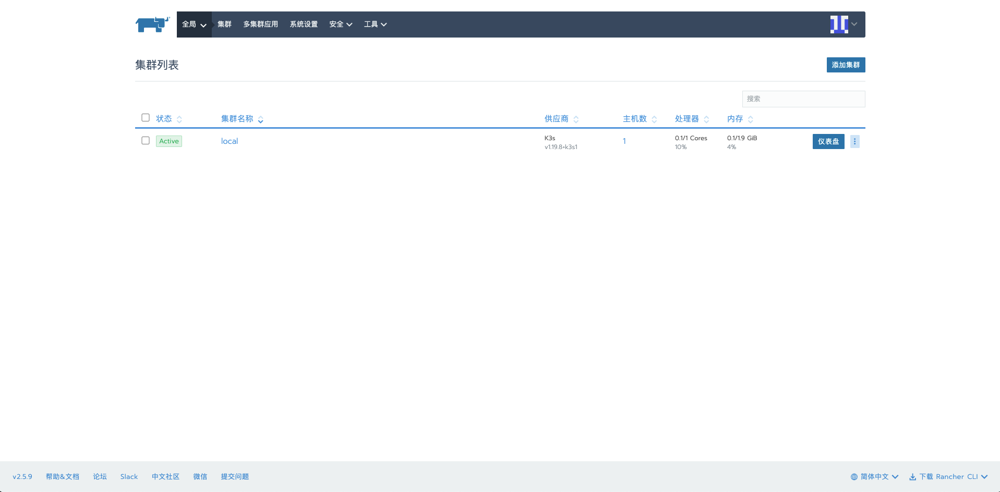
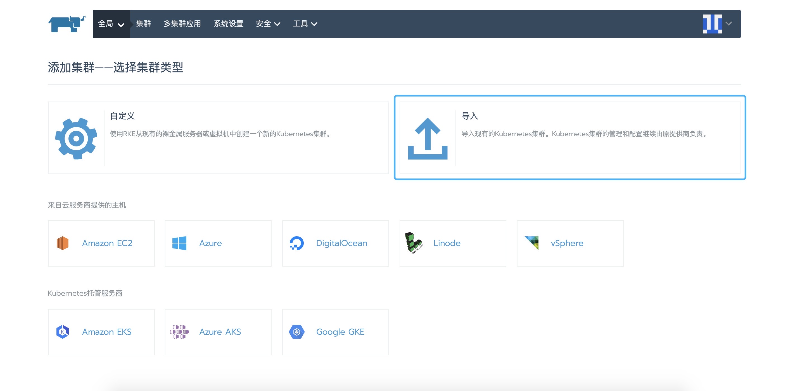
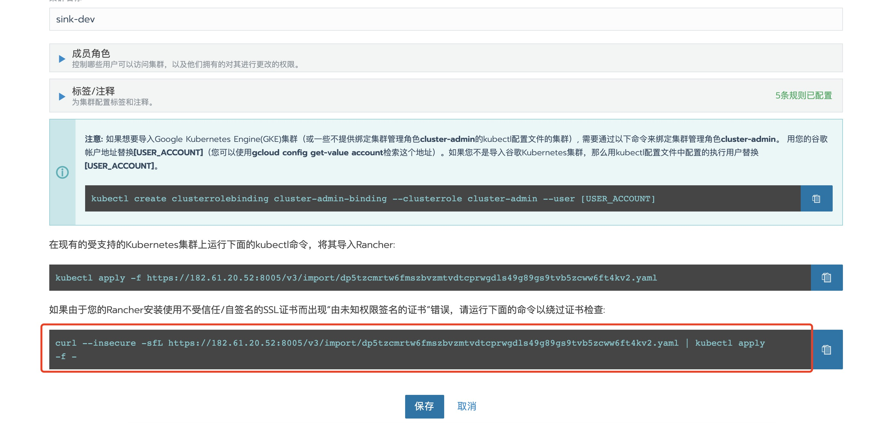
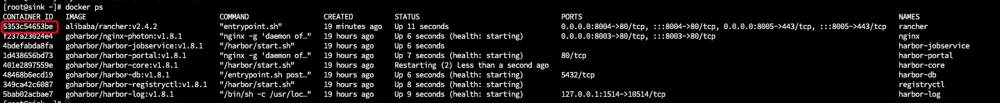
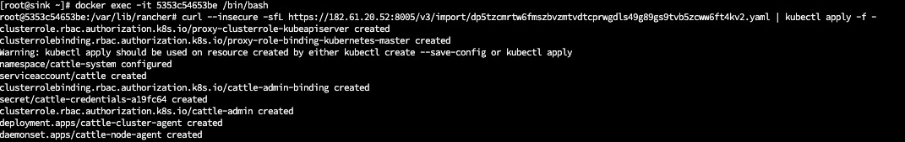

### rancher安装

- 下载镜像
```shell script
docker pull registry.cn-hangzhou.aliyuncs.com/rancher/rancher:v2.5.9
```

- 启动

```shell script
docker run \
-d \
--name rancher \
--privileged \
--restart=unless-stopped \
-e CATTLE_AGENT_IMAGE="registry.cn-hangzhou.aliyuncs.com/rancher/rancher-agent:v2.4.2" \
-v /home/docker/rancher/:/var/lib/rancher/ \
-p 8004:80 -p 8005:443 \
registry.cn-hangzhou.aliyuncs.com/rancher/rancher:v2.5.9
```

- 访问
> `使用https端口访问` https://127.0.0.1:8005
> 

- 添加集群
> 

- 复制命令进入容器内执行
> 

```shell script
docker ps
```
> 

```shell script
docker exec -it 5353c54653be /bin/bash
```

- 执行命令
> 