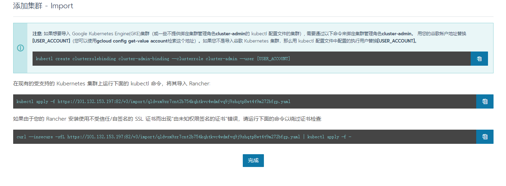

- 下载安装rancher
> 开启对应的端口访问即可
```shell script
docker run -d --restart=unless-stopped -v /root/rancher:/var/lib/rancher/ -p 81:80 -p 82:443 rancher/rancher:stable
```
> 以Https访问地址
> 创建集群





- 进入rancher主机
```shell script
curl --insecure -sfL https://101.132.153.197:82/v3/import/qldvxm9sr7cnt2b754kqhtkvc4wdmfvq9j9shqtp8wt4t9m272bfgp.yaml | kubectl apply -f -
```
- 查看状态
```shell script
kubectl get pods -n cattle-system
```