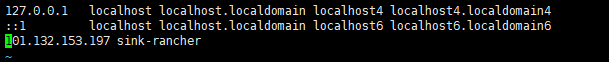

> dubbox项目github地址:https://github.com/dangdangdotcom/dubbox
```shell script
tar -zxvf apache-tomcat-8.5.30.tar.gz 

# tomcat重命名（系统里面已经有了一个tomcat为了区分所以就重命名了）
mv apache-tomcat-8.5.30.tar.gz /usr/local/dubbo-tomcat-8.5.30

#删除dubbo-tomcat-8.5.30中webapp中所有的内容
cd /usr/local/dubbo-tomcat-8.5.30/webapps/
rm -rf *
# 上传并且解压dubbo-admin-2.8.4.war,并且把目录命名root
unzip dubbo-admin-2.8.4.war -d ROOT
```
- 配置dubboproperties(根据实际情况修改用户名密码以及zookeeper地址)
```shell script
vi ROOT/WEB-INF/dubbo.properties
#dubbo.registry.address=zookeeper://ip:2181
#dubbo.admin.root.password=root
#dubbo.admin.guest.password=guest
```
- 启动tomcat服务(如果有两个tomcat的话需要修改端口否则有一个起不来)
```shell script
./usr/local/dubbo-tomcat-8.5.30/bin/startup.sh
```
> 浏览器中验证
> IP:dubbo-tomcat-8.5.30端口
> 账号和密码则是dubbo.properties中的

- 问题
> 服务部署完成后，在注册中心发现注册的IP为内网IP,导致请求失败
- 获取本机名称
```shell script
hostname
```
- 修改host文件
```shell script
vim /etc/hosts

外网IP 本机名称
```

> 重启服务即可