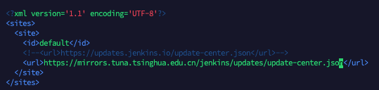

### jenkins安装
- 安装
````shell script
sudo wget -O /etc/yum.repos.d/jenkins.repo https://pkg.jenkins.io/redhat-stable/jenkins.repo
sudo rpm --import https://pkg.jenkins.io/redhat-stable/jenkins.io.key
yum install jenkins
````

- 配置jdk地址
```shell script
vim /etc/init.d/jenkins
```
```
${jdk_path}/bin/java
```


-启动端口已经工作目录配置
```shell script
vim /etc/sysconfig/jenkins
```
```
JENKINS_HOME="/home/jenkins"
JENKINS_USER="root"
JENKINS_PORT="8588"
```

- 启动
```shell script
systemctl start jenkins
```

- 问题
> 进入首页一直处于 `Please wait while Jenkins is getting ready to work ...`  
> 修改 `/home/docker/jenkins/jenkins_home`下`hudson.model.UpdateCenter.xml`中  
> `https://updates.jenkins.io/update-center.json` 
>  更改为国内镜像地址 `https://mirrors.tuna.tsinghua.edu.cn/jenkins/updates/update-center.json`


- 在浏览器访问ip:port 即可（在此之前需开放端口，如果是学习之用可关闭防火墙），如果此时提示 Please wait while Jenkins is getting ready to work，长时间没反应则

> 将 `https://updates.jenkins.io/update-center.json` 修改为 `http://mirror.xmission.com/jenkins/updates/update-center.json`
```shell script
vi /home/jenkins/hudson.model.UpdateCenter.xml
```
```shell script
systemctl daemon-reloadc
```


- jenkins打包项目
>[jenkins配置](/docker/jenkins_build.md)