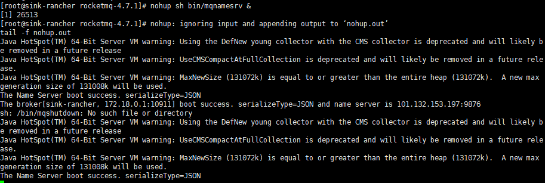
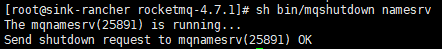
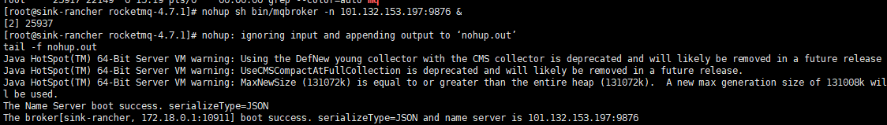
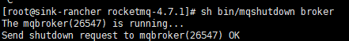
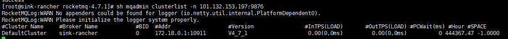
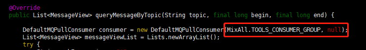
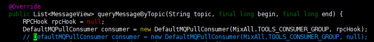
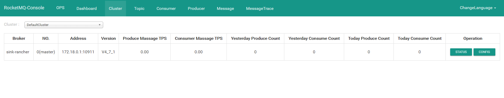
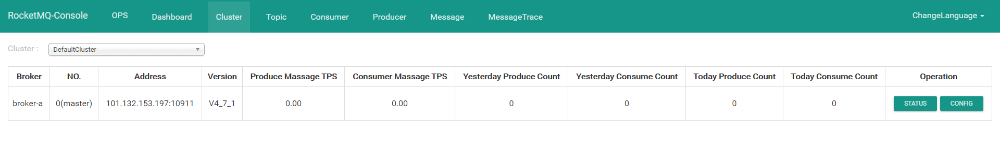

> 开发指南 https://github.com/apache/rocketmq/tree/master/docs/cn
- 下载安装文件
> http://rocketmq.apache.org/
> 默认已安装jdk并配置环境变量

## 安装RockerMq
> 解压
```shell script
unzip rocketmq-all-4.7.1-bin-release.zip
```
> 配置环境变量
```shell script
vim /etc/profile

# rockerMq环境变量
export ROCKETMQ_HOME=/home/rocketmq-4.7.1
export PATH=$PATH:${ROCKETMQ_HOME}/bin

source /etc/profile
```
- 新建目录
```shell script
mkdir -p /home/rocketmq-4.7.1/data/store/{commitlog,consumequeue,index}
```
- 修改配置文件
> 启动参数默认对jvm的堆内存设置比较大(不改启动不起来)，如果是虚拟机非线上环境需要改下参数，大小可以根据自己机器来决定。
>
> `runbroker.sh` `runserver.sh`
```shell script
JAVA_OPT="${JAVA_OPT} -server -Xms256m -Xmx256m -Xmn128m"
```

- 启动 Name Server
```shell script
nohup sh bin/mqnamesrv &
```

- 停止 Name Server
```shell script
sh bin/mqshutdown namesrv
```


- 启动 Broker
> nohup sh bin/mqbroker -n 本地IP:9876 &
```shell script
nohup sh bin/mqbroker -n 101.132.153.197:9876 autoCreateTopicEnable=true -c conf/broker.conf &
```

- 停止 Broker
```shell script
sh bin/mqshutdown broker
```


- 查看启动情况
```shell script
sh mqadmin clusterlist -n 101.132.153.197:9876
```


- 配置name server地址
```shell script
vim /etc/profile
export NAMESRV_ADDR=101.132.153.187:9876
source /etc/profile
```

## 安装Rocket-Console
> https://github.com/apache/rocketmq-externals
>
> 开启9876、10911端口
- 拉取项目
```base
git clone https://gitee.com/mirrors/RocketMQ-Externals
```
- 修改配置
> src\main\resources\application.properties
```shell script
server.port=8088
rocketmq.config.namesrvAddr=101.132.153.197:9876
```
- 编译
```shell script
cd RocketMQ-Externals/rocketmq-console
mvn clean package -Dmaven.test.skip=true
```
- 启动
```
nohup java -jar rocketmq-console-ng-2.0.0.jar &
```

- 问题
> <rocketmq.version>4.7.1</rocketmq.version> 中已修复 下面问题在 4.0.0中发生
> 
> Caused by: org.apache.rocketmq.remoting.exception.RemotingConnectException: connect to <null> failed
>


> 修改后重新编译打包
```base
import org.apache.rocketmq.remoting.RPCHook;

RPCHook rpcHook = null;
DefaultMQPullConsumer consumer = new DefaultMQPullConsumer(MixAll.TOOLS_CONSUMER_GROUP, rpcHook);
```


>  No topic route info in name server for the topic: %RETRY%FILTERSRV_CONSUMER
- > Broker禁止自动创建Topic，且用户没有通过手工方式创建Topic
  > 
  > 启动broker时加上autoCreateTopicEnable=true 
  ```
  nohup sh bin/mqbroker -n 101.132.153.197:9876 autoCreateTopicEnable=true &
  ```
> - Broker没有正确连接到Name Server
> - Producer没有正确连接到Name Server 

- broker启动时获取的是内网IP


> 修改配置文件
> /home/rocketmq-4.7.1/conf/broker.conf
```shell script
brokerClusterName = DefaultCluster
brokerName = broker-a
brokerId = 0
deleteWhen = 04
fileReservedTime = 48
brokerRole = ASYNC_MASTER
flushDiskType = ASYNC_FLUSH
namesrvAddr = 外网IP:9876
brokerIP1=外网IP
waitTimeMillsInSendQueue=400
```
> 启动时指定配置文件 `-c conf/broker.conf`
```shell script
nohup sh bin/mqbroker -n 101.132.153.197:9876 autoCreateTopicEnable=true -c conf/broker.conf &
```


> 启动命令
```shell script
nohup sh mqnamesrv &
nohup sh mqbroker -n "127.0.0.1:9876" -c ../conf/broker.conf &tail -f nohup.out

nohup java -jar rocketmq-console-ng-2.0.0.jar --server.port=8088 --rocketmq.config.namesrvAddr=127.0.0.1:9876 &
```