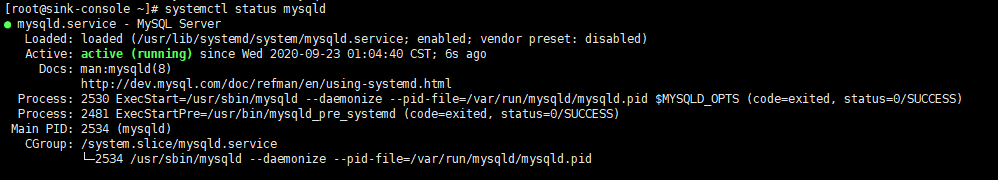

- 添加扩展源
```shell script
wget http://repo.mysql.com/mysql57-community-release-el7-8.noarch.rpm
```
- 安装
```shell script
rpm -ivh mysql57-community-release-el7-8.noarch.rpm
yum install mysql-server -y
```
- 启动
```shell script
systemctl start mysqld
```

- 获取初始密码
```shell script
grep 'temporary password' /var/log/mysqld.log
```

- 更改密码
> 输入初始密码进行更换
```shell script
mysql_secure_installation
```
- 重启服务
```shell script
systemctl restart mysqld
```

- 远程访问
```shell script
mysql -u root -p
use mysql;
```
> 查询下你的用户名为root下host字段的参数
```shell script
select 'host' from user where user='root';
update user set host ='%'where user ='root';
```
> 刷新配置
```shell script
flush privileges;
```
- 开启关闭忽略表名大小写
```shell script
vim /etc/my.cnf
lower_case_table_names=1 # 1、关闭 0开启
service mysqld restart
```
- 操作命令
```shell script
systemctl start mysqld
systemctl restart mysqld
systemctl stop mysqld

systemctl enable mysqld #开机自启
```